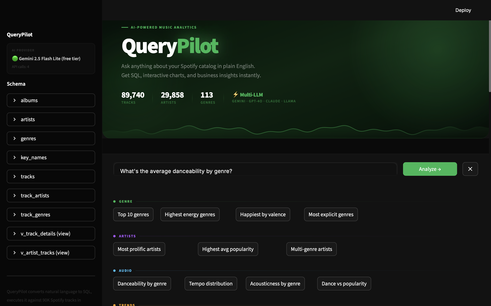
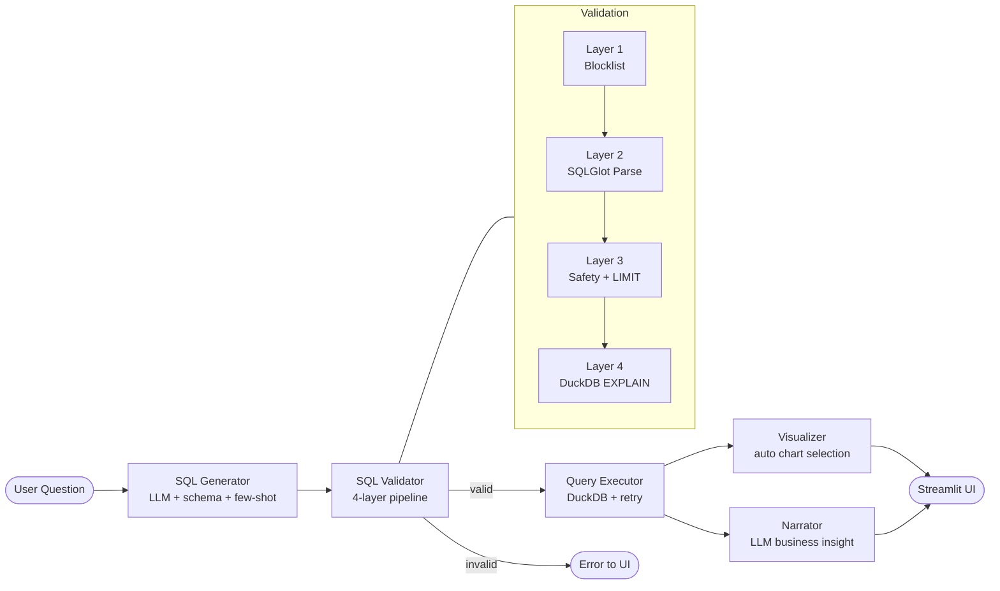

# QueryPilot

**Turn plain English into SQL, charts, and business insights — powered by AI**

QueryPilot is a portfolio-grade analytics application that lets anyone query a normalized Spotify dataset using natural language. Ask a question, get back production-quality SQL, an auto-selected Plotly chart, and an executive-ready business insight — all in under 10 seconds.



---

## Features

- **Natural language → SQL** with schema-aware generation and 10-shot few-shot examples
- **4-layer SQL validation pipeline** (blocklist → parsing → safety/LIMIT check → DuckDB dry-run)
- **Intelligent auto-visualization** across 8 chart types, selected by heuristic + LLM hint
- **AI-generated business narratives** for every query result — VP-level, 3–5 sentences
- **Built-in evaluation benchmark** with 30 test questions, scoring accuracy and chart selection

---

## Demo

```
User:  Which genres have the highest average energy?

SQL:   SELECT genre_name, ROUND(AVG(energy), 3) AS avg_energy
       FROM v_track_details
       GROUP BY genre_name
       ORDER BY avg_energy DESC
       LIMIT 10

Chart: Horizontal bar chart (auto-selected)

Insight: Metal dominates on energy, averaging 0.91 — nearly double the
         catalog mean of 0.49. This positions it as the go-to genre for
         workout and high-intensity playlists. Labels in acoustic or
         ambient spaces should note the dramatic floor-to-ceiling range
         (0.07–0.91) when pitching mood-based curation.
```

---

## Architecture



---

## Multi-Provider LLM Support

QueryPilot works out of the box with any of four providers. Set whichever key you have — the app detects it automatically and falls back in priority order:

| Priority | Provider | Model | Free Tier |
|----------|----------|-------|-----------|
| 1 | **Google Gemini** | gemini-2.5-flash-lite | Yes — start here |
| 2 | **Groq** | llama-3.3-70b-versatile | Yes — no daily cap |
| 3 | **Anthropic** | claude-sonnet-4-20250514 | No (paid) |
| 4 | **OpenAI** | gpt-4o | No (paid) |

The Gemini free tier is the fastest way to get started — no billing required. The app tracks API calls per session and includes exponential-backoff retry logic for all providers.

---

## Data Engineering

The raw dataset is a flat 114,000-row Spotify CSV. Serving queries directly from a flat file produces slow, fragile SQL. QueryPilot normalizes it into a proper relational schema as part of database setup:

```
Raw CSV (114K rows, ~25 columns)
        │
        ▼
┌─────────────┐    ┌─────────────┐    ┌─────────────┐
│   tracks    │    │   artists   │    │   albums    │
│  89,740 rows│    │ 29,858 rows │    │ 46,589 rows │
└──────┬──────┘    └──────┬──────┘    └─────────────┘
       │                  │
       ▼                  ▼
┌─────────────┐    ┌─────────────┐    ┌─────────────┐
│track_artists│    │track_genres │    │   genres    │
│ junction tbl│    │ junction tbl│    │  113 rows   │
└─────────────┘    └─────────────┘    └─────────────┘
       │
       ▼
┌────────────────────┐    ┌─────────────────────┐
│  v_track_details   │    │  v_artist_tracks    │
│  (denorm view for  │    │  (view for artist-  │
│   fast querying)   │    │   level aggregates) │
└────────────────────┘    └─────────────────────┘
```

**Why this matters:** Raw Spotify data stores artists as semicolon-separated strings (`"Ingrid Michaelson;ZAYN"`). Normalizing into a `track_artists` junction table lets SQL treat each artist independently — so `WHERE artist_name = 'ZAYN'` works correctly. This is the difference between a data dump and a queryable dataset.

The normalization runs once on first launch and persists to a DuckDB file, so subsequent starts are instant.

---

## Key Design Decisions

### Why normalize the data?
Denormalized flat files are fine for exploration but break when users ask artist-level questions. Proper normalization is a core data engineering skill — it demonstrates understanding of foreign keys, junction tables, and query optimization rather than just loading a CSV into pandas.

### Why DuckDB?
DuckDB is purpose-built for analytical queries — columnar storage, vectorized execution, no server process. It runs embedded in the Python process, queries 90K rows in under 50ms, and produces the same SQL dialect as production data warehouses (BigQuery, Redshift, Snowflake). No Docker, no database server, no connection strings.

### Why 4-layer validation?
A single `re.search(r"DROP|DELETE", sql)` check is not production thinking. Each layer catches a different failure class:
- **Layer 1 (blocklist):** Catches obvious destructive keywords before any parsing
- **Layer 2 (SQLGlot):** Structural validity — catches syntax errors, malformed queries
- **Layer 3 (safety):** Enforces LIMIT, bans writes, rejects multi-statement queries
- **Layer 4 (EXPLAIN):** Catches column-not-found errors, wrong table references — the subtle bugs that bypass string matching

### Why auto-visualization?
The goal is for anyone to ask a question and get an immediately useful answer, not a raw table. Chart type selection (bar vs. horizontal bar vs. pie vs. scatter vs. heatmap) is driven by heuristics on the data shape — number of categories, label length, column types — combined with an LLM hint from the SQL generator. This is product thinking baked into the codebase.

### Why business narratives?
SQL results tell you *what* the data says. The narrative tells you *why it matters*. Generating VP-level insights in code form demonstrates that engineering output should serve business decisions, not just be technically correct. It also shows the LLM being used as a reasoning tool, not just a code generator.

---

## Guardrails & Safety

Every query passes through a 4-layer validation pipeline before touching DuckDB:

```
Layer 1 — Blocklist
  DROP, DELETE, INSERT, UPDATE, ALTER, CREATE, EXEC, TRUNCATE, GRANT → rejected instantly

Layer 2 — SQLGlot Parse
  Parse the SQL with SQLGlot (dialect=duckdb). Any syntax error → rejected with message.

Layer 3 — Safety Rules
  • Must contain SELECT
  • Must contain LIMIT (prevents runaway full-table scans)
  • Single statement only (blocks injection via semicolons)
  • No subquery depth > 5
  Complexity score (1–5) computed from JOIN count, subquery depth, aggregation count.

Layer 4 — DuckDB EXPLAIN Dry-Run
  Run EXPLAIN {sql} against the live database.
  Catches: unknown column names, non-existent tables, wrong function signatures.
  Zero rows are returned — no data is read — but the planner validates the query.
```

Failed validations return structured error messages to the LLM for a single auto-retry.

---

## Evaluation Results

The benchmark runs 30 questions across difficulty tiers (easy / medium / hard) and categories (aggregation / filtering / ranking / complex). It measures execution success, column accuracy, row count accuracy, and — with `--semantic` — LLM-as-judge correctness scoring.

**Note:** The full 30-question run uses ~30 API calls (or ~60 with `--semantic`). Groq is recommended for benchmark runs — it has no daily request cap on the free tier.

Run the evaluation:

```bash
# Basic (SQL execution metrics only)
python run_evaluation.py

# With semantic judge (LLM-as-judge correctness scoring)
python run_evaluation.py --semantic

# Filter by difficulty or specific IDs
python run_evaluation.py --difficulty easy
python run_evaluation.py --ids 1 2 3 4 5

# Skip delays for paid API tiers
python run_evaluation.py --fast

# Report saved to benchmarks/evaluation_report.md
```

**Results** (27/30 questions, Groq free tier, with `--semantic`):

| Metric | Score |
|--------|-------|
| SQL execution success rate | **90%** (27/30) |
| Semantic accuracy (LLM-as-judge) | **96.2%** (26 judged) |
| Average semantic score | **0.98 / 1.0** |
| Row count accuracy (of successful) | 81.5% |
| Column accuracy (of successful) | 51.9% |
| Average execution time | **22ms** |

| Difficulty | Success Rate |
|------------|-------------|
| Easy (10 questions) | 100% |
| Medium (12 questions) | 100% |
| Hard (8 questions) | 62.5% |

The column accuracy gap reflects the LLM generating semantically correct but differently-named aliases (e.g., `genre` vs `genre_name`). The semantic judge — which scores based on whether the result correctly answers the question, not whether column names match — gives 96.2% accuracy and an average score of 0.98/1.0.

---

## Tech Stack


| Layer | Technology |
|-------|-----------|
| UI | Streamlit |
| Database | DuckDB |
| SQL Parsing & Validation | SQLGlot |
| Data Manipulation | Pandas |
| Visualization | Plotly Express + Graph Objects |
| LLM Abstraction | Custom multi-provider client |
| Schema Validation | Pydantic v2 |
| Config | python-dotenv |

---

## Quick Start

**1. Clone the repo**
```bash
git clone https://github.com/yourusername/querypilot.git
cd querypilot
```

**2. Create a virtual environment and install dependencies**
```bash
python -m venv venv
source venv/bin/activate      # Windows: venv\Scripts\activate
pip install -r requirements.txt
```

**3. Get a free Gemini API key**

Go to [aistudio.google.com](https://aistudio.google.com) → "Get API key" → free, no billing required.

**4. Set your API key**
```bash
cp .env.example .env
# Edit .env and add your key:
# GOOGLE_API_KEY=your_key_here
```

Alternatively, use any other provider:
```
ANTHROPIC_API_KEY=...   # Claude Sonnet 4
OPENAI_API_KEY=...      # GPT-4o
GROQ_API_KEY=...        # Llama 3.3 70B (also free)
```

**5. Add the Spotify dataset**

Download the [Spotify Tracks dataset from Kaggle](https://www.kaggle.com/datasets/maharshipandya/-spotify-tracks-dataset) and place it at:
```
data/dataset.csv
```

**6. Run the app**
```bash
streamlit run app.py
```

The database normalizes automatically on first launch (~10 seconds). Open `http://localhost:8501`.

---

## Example Questions

```
What are the top 10 genres by number of tracks?
Which artists have the most tracks in the dataset?
Show me songs with danceability above 0.9 and energy above 0.8
What's the average tempo by genre?
Which genres have the most explicit tracks?
Find artists who appear in more than 5 different genres
What are the happiest songs by valence score?
Compare acousticness across the top 10 most popular genres
Which album has the longest average track duration?
Show me the relationship between energy and popularity
```

---

## Project Structure

```
querypilot/
├── app.py                    # Streamlit UI — all UI logic
├── run_evaluation.py         # Benchmark runner
├── requirements.txt
├── .env.example
├── data/
│   └── spotify_tracks.csv    # Raw dataset (not committed)
├── benchmarks/
│   └── test_questions.json   # 30 benchmark questions
├── docs/
│   └── demo.png              # Screenshot for README
└── src/
    ├── llm_provider.py       # Multi-provider LLM abstraction
    ├── database.py           # DuckDB setup + normalization
    ├── sql_generator.py      # NL → SQL with few-shot prompting
    ├── sql_validator.py      # 4-layer validation pipeline
    ├── query_executor.py     # Execution + LLM-powered retry
    ├── visualizer.py         # Auto chart selection + rendering
    ├── narrator.py           # Business narrative generation
    └── evaluation.py         # Benchmark scoring logic
```

---

## Limitations & Future Work

**Current limitations**
- The Gemini free tier caps at 20 requests/day — set `GROQ_API_KEY` in `.env` for unlimited free usage during development and benchmarking
- No authentication — intended as a local or demo deployment
- Schema is fixed to the Spotify dataset; connecting a custom database requires extending `database.py`

**Already implemented**
- [x] Query history persistence across sessions (SQLite, survives page refreshes)
- [x] CSV export for every query result
- [x] Semantic evaluation using LLM-as-judge — `python run_evaluation.py --semantic`

**Possible extensions**
- [ ] Upload your own CSV or connect to a PostgreSQL/Snowflake database
- [ ] Streaming SQL generation with `st.write_stream`
- [ ] Shareable query links via URL parameters

---

## License

MIT — see [LICENSE](LICENSE).

---

*Built as a portfolio project demonstrating end-to-end data engineering, LLM integration, and product thinking.*
